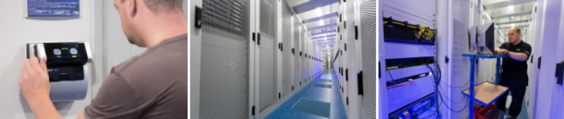
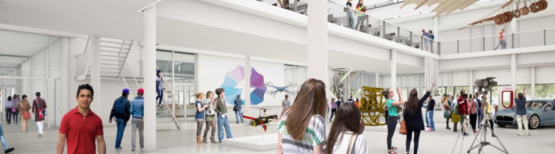
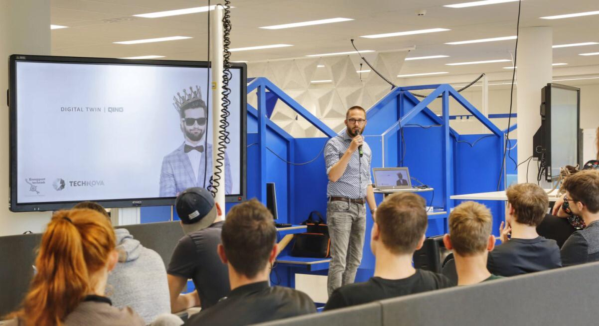
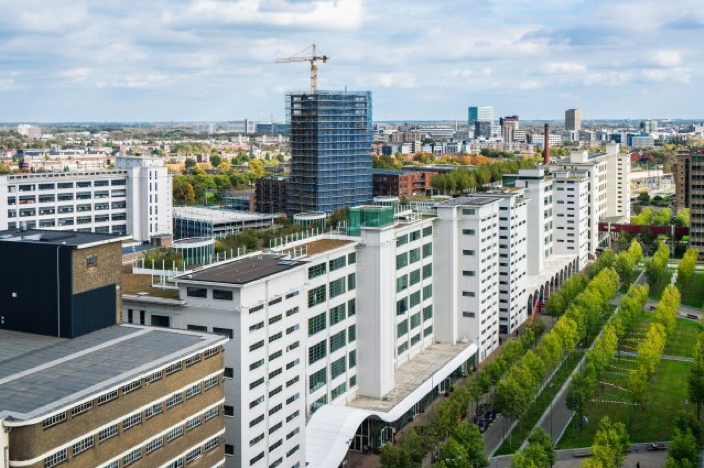
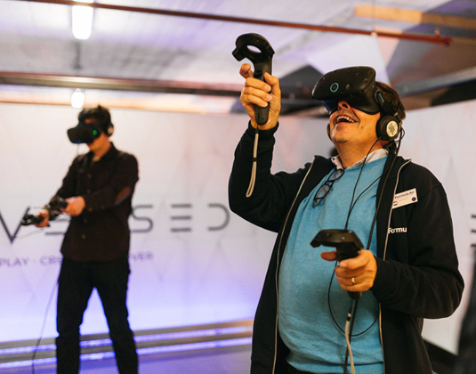
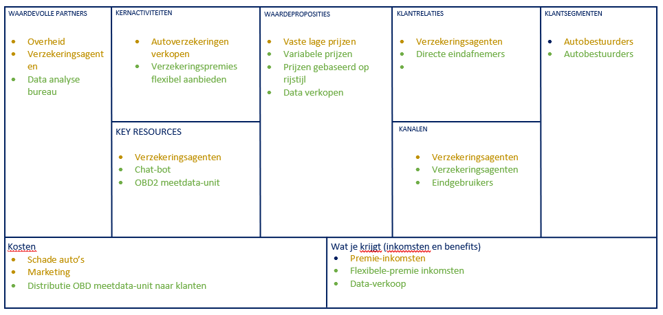
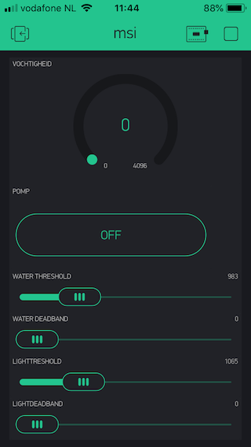
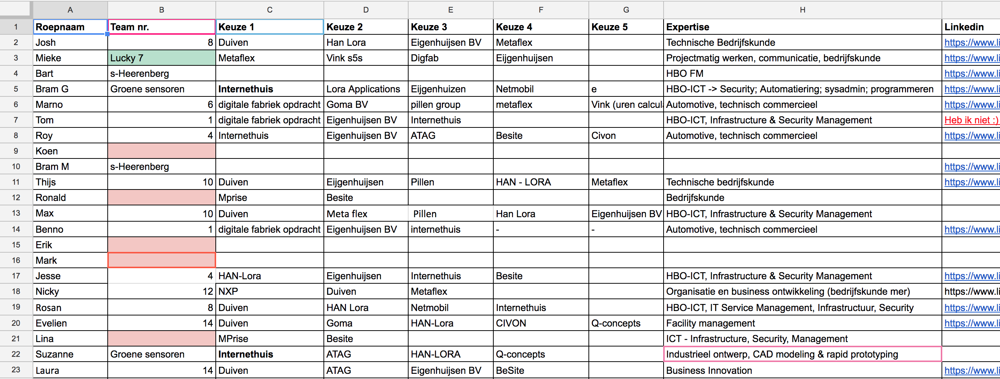
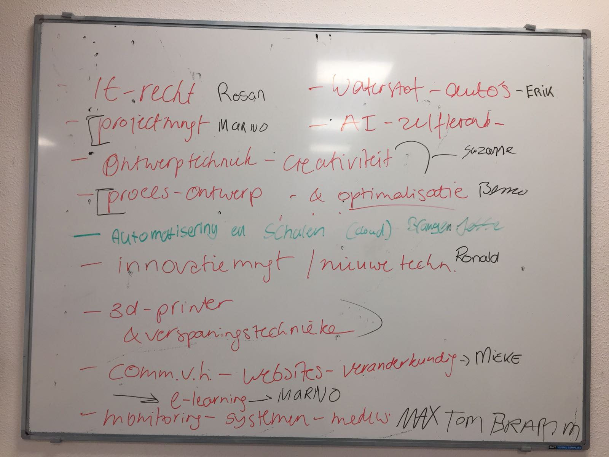

<script>
  $(document).ready(function() {
    $('#TOC').parent().prepend('<div id=\"nav_logo\"></div>');
  });
</script>

```{r setup, include=FALSE}
knitr::opts_chunk$set(echo = TRUE)
library(kableExtra)
```
<h1 class="welkom toc-ignore">Welcome Smart!</h1>

<p class="welkom" >
Volg hier de ontwikkelingen bij de HAN Minor Smart Industry. Wat is er gebeurd en wat gaat er komen? Waar zijn de deelnemers mee bezig? Welke mooie voorbeelden van Smart Industry komen we tegen?
</p>
<hr>

### 12 november 2018 - Aankondiging Pitstop 2 Minor Smart Industry

Wil je samen met ons je Smart ambities realiseren? Zoek je hiervoor inspiratie? Kom op VRIJDAG 11 JANUARI 2019 naar de Hogeschool van Arnhem en Nijmegen voor een ontmoeting met Smart Industry. Kijk <a href="https://minorsmart.github.io/pitstop/#/" target="_blank">hier</a> voor meer informatie en meld je aan (plaats zolang de voorraad strekt).

### 5 november 2018 - Pitstop 1 Minor Smart Industry

Vrijdag 26 Oktober 2018 - *Een verslag van Bart Dijken en Bram Marissink*

Inmiddels zitten de 6 weken intensieve les over het onderwerp Smart Industry er al een tijdje op en zijn alle projectgroepjes begonnen bij hun opdrachtgever. Om te kijken hoe ver iedereen is en elkaar te helpen bij mogelijke problemen is er een pitstop georganiseerd.

Tijdens deze bijeenkomst waren alle groepjes aanwezig en ook de 6 vakdocenten. De datum van de pitstop is geprikt door de docenten van de minor maar vervolgens hebben de studeten zelf het programma in elkaar gezet en onderling gezorgd voor een goed georganiseerde pitstop. 

Op de pitstop kreeg ieder groepje ongeveer 10 minuten de tijd om de voortgang van hun opdracht te presenteren. Vervolgens kon de groep hier vragen over stellen en tips geven. Daarnaast was er natuurlijk ook ruimte voor de projectgroepjes om de medestudente te vragen om hulp en zo te profiteren van elkaars kennis. 

Hieronder de projecten per groep en daarbij de organisatie waar de studenten het project voor doen:

```{r echo=FALSE, message=FALSE, warning=FALSE, paged.print=FALSE}
psDF <- read.csv("pitstop1.csv", sep = ",")
kable(psDF, caption = "Tabel 1 - Projecten Minor Smart Industry") %>%
  kable_styling(bootstrap_options = c("striped", "hover", "condensed", "responsive"))
```

<hr>
Om een goed beeld te krijgen van wat de groepjes hebben gepresenteerd staat <a href="https://drive.google.com/drive/folders/1H9mgWAmd4dVfMqCGi1ZlfFbGoPXfkJjF?usp=sharing" target="_blank">hier</a> een link naar een google drive map waar alle groepjes de presentaties hebben neergezet. De presentaties zijn verdeeld over verschillende mappen. De mappen hebben de naam van het bedrijf waar het project wordt uitgevoerd.

Alle groepjes hebben de gekregen feedback genoteerd en zijn inmiddels druk met het verwerken van deze tips. Daarnaast wordt er binnenkort weer een nieuwe datum gekozen voor de tweede pitstop. Waar de eerste pitstop vooral gericht was op de opzet van de opdracht en het plan van aanpak, zal de tweede pitstop meer gaan over de inhoud van de opdracht. Wanneer de tweede pitstop is geweest komt hierover ook een update in de nieuwsbrief.

<hr>

### 23 oktober 2018 - Excursie BIT / QING-workshop in Technova College

Woensdag 17 oktober zijn de minor-studenten gastvrij ontvangen door <a href="https://www.bit.nl/" target="_blank">BIT</a> in Ede om kennis te maken met een leverancier datacentrum ICT-diensten. In de BIT-datacentra kunnen bedrijven hun netwerksystemen en serversystemen plaatsen voor websites, applicaties en ‘private’ clouds. BIT beschikt over drie modern ingerichte datacentra waar 24/7 gegarandeerde zekerheid word gegarandeerd en is gerealiseerd voor stroom, temperatuurcontrole (koeling), brandbeveiliging, toegangsbeveiliging en gezekerde snelle netwerkverbindingen naar alle belangrijke Internet Exchanges (koppelpunten).

Een van die centra staat in Ede bij het hoofdkantoor van BIT waar de minorstudenten op bezoek waren. Na een gastcollege over de structuur en belangrijkste protocollen, services en kenmerken van ‘Het internet’ mochten we ook onder begeleiding door de dikke kluisdeuren in het streng beveiligde datacentrum ervaren hoe de honderden servers in hun racks permanent de rekenkracht en communicatie voor vele bedrijven leveren.

De warmteproductie in de kluis was goed zichtbaar en voelbaar vooral bij de speciale cryptomining-servers die uitsluitend met veel rekenkracht (miljoenen processorinstructies per seconde: MIPS) unieke getallen berekenen. Die getallen worden dan als digitale munten ‘verkocht’ op daarvoor ingerichte handelsbeurzen. Als de capaciteit in het datacentrum vol wordt benut neemt het evenveel energie uit het electriciteitsnet op als het naastgelegen dorp Bennekom! Zeer indrukwekkend om te zien, wat er allemaal voor nodig is om de 24/7 continuiteit voor alle digitale diensten van bedrijven te garanderen.
 


Na middagpauze werden we ontvangen op het Technova College in Ede. Daar presenteerde het bedrijf <a href="https://www.qing.nl/" target="_blank">QING</a> voor de minor studenten MSI en de mbo-studenten ICT en Mechatronica een gastcollege over hun projectaanpak en de toepassing van simulatie in het bijzonder voor technische  bedrijfsprocessen. In een interactieve enquete werd de mening van het publiek op de voorliggende thema’s gepeild.


 
Na het gastcollege kregen de minor-studenten de gelegenheid hun projectcasus te bespreken met de studenten van het Technova College. Dat leidde voor sommige projecten tot een interessante kennismaking en suggesties en adviezen voor de projectaanpak en de toepassing van simulatie.

Ongetwijfeld vertrokken de deelnemers met nieuwe ervaringen vanuit het Technova College huiswaarts. Enkele projectgroepen maken nog graag gebruik van het QING-aanbod om in het project waar mogelijk bij te dragen aan een simulatie-adviestraject.


<hr>

### 1 oktober 2018 - Excursie Smart City / STRIJP-S in Eindhoven

Dinsdag 25 september vroeg op pad, want om 8.30u vertrok de bus met minor studenten en enkele medewerkers van partner bedrijven naar Eindhoven voor een excursie naar een Smart-City in Ontwikkeling. De gemeente Duiven was de gastheer die deze dag organiseerde voor medewerkers van bedrijven, de gemeente Duiven en studenten van de Minor Smart Industry. 
Het programma werd door de studenten zeer gewaardeerd. Boeiend qua inhoud, entertaining in ervaring en uitstekend in facilitering van lunch, borrel en bus.

Na de ontvangst in het Video-lab met koffie en koek ter aanvulling van het ontbijt werd bij de maquette van Strijp-S het smart stadsdeel van Eindhoven toegelicht hoe de transformatie van industrie-stad op de fundamenten van de vele ‘Philips-gebouwen’ naar een Smart-City al in volle gang is en de komende jaren nog verder wordt ontwikkeld. Van de glas-lampen naar glas-vezels in breedbandige verbindingen en nieuwe toepassingen van digitalisering tussen partners in de stad: bewoners en (nieuwe) bedrijven groot en klein, nieuwe initiatieven en nieuwe huisvesting voor smart werken en wonen en leven in de ‘slimme stad’.


 
In het bezoek aan <a href="http://www.enversed.com/" target="_blank">Enversed</a> (Europa’s grootste Virtual Reality Center) werd entertaining gecombineerd met een concrete uitgekiende ervaring in Virtual Reality. Het verschil vervaagt in realiteit: samenwerken aan de lopende band van een hamburger-restaurant op straffe van ‘ontslag’ bij te geringe correcte productie. De bezoekers zijn in feite proefkonijnen voor de ontwikkeling van Virtual-Experience die het bedrijf met 20 medewerkers ook voor diverse klanten ontwikkeld en in meer dan 10 experience test-rooms laat ‘spelen. Zo wordt virtualiteit verder ontwikkeld. Iedereen mocht zich anderhalf uur virtueeel uitleven in deze verassende digitaal volledig maakbare werelden.



De Smart-Walk door Strijp-S werd geregistreerd in een Groupselfie door de publiek beschikbare camera die via een scancode wordt geactiveerd. 
Voor veel studenten was de “tafelrede” van Bas Luiting <a href="http://www.bb-bricks.nl/" target="_blank">(www.bb-bricks.nl)</a> en het bezoek aan <a href="http://www.plugincity.nl/" target="_blank">PlugIn city</a> een inspirerende (nieuwe) kennismaking met circulair ondernemen. Plugin city is het creatieve circulaire hart in Strijp-S waar met passie door pluggers een nieuwe werkelijkheid uit oude (afval)materialen wordt gepresenteerd en gerealiseerd. Vooral de studiekamerkontainer kon vele studenten wel bekoren al was het alleen al om de kamerhuur te kunnen halveren.


 
Het programma werd afgesloten door een inspiratielezing over de smart city trends door Kees Jansen in het oorspronkelijke Philips NatLab, waar in de vorige eeuw vele vindingen van Philips Research zijn gepresenteerd ter toetsing bij collega’s, directies en stakeholders.
Na de netwerk borrel bracht de bus, de trein of de eigen auto de studenten en de andere deelnemers weer thuis om nog lang na te genieten en door te denken op de vele voorbeelden van smart city inspiraties.

```{r echo=FALSE, message=FALSE, warning=FALSE, paged.print=FALSE}
library(bsplus)
bs_carousel(id = "bmc", use_indicators = TRUE) %>%
  bs_append(content = bs_carousel_image(src = "vr1.jpeg")) %>%
  bs_append(content = bs_carousel_image(src = "vr2.jpeg")) %>%
  bs_append(content = bs_carousel_image(src = "vr3.jpeg")) %>%
  bs_append(content = bs_carousel_image(src = "field.jpeg")) %>%
  bs_append(content = bs_carousel_image(src = "container.jpeg")) %>%
  bs_append(content = bs_carousel_image(src = "plugincity.jpeg"))
```

<hr>

### 1 oktober 2018 - Business Model Canvas

Deze keer een bericht van <a href="https://tinyurl.com/ycxdm8z2" target="_blank">Marno</a>: 

Tijdens de workshop van Geert Rensen is er gekeken naar 'smart oplossingen' van een verzekeringsmaatschappij. De casus was als volgt:</br>

De Turkse regering had besloten om recentelijk de premies van autoverzekeringen collectief te verlagen met 30%. Hierdoor zijn de auto casco verzekeringen verliesgevend geworden. De verzekeraar wil graag actief blijven in de markt. Het verzekeringsbedrijf verkoopt de polissen via een agentennetwerk. Het bedrijf heeft dus geen rechtstreeks contact met zijn klanten.</br>

De vraag was: Op welke wijze zou deze verzekeraar – met behulp van Smart concepten – haar business model kunnen aanpassen, om toch (winstgevend) actief te kunnen blijven in deze markt? De uitkomst hiervan is weergeven is een businessmodel canvas met geel als huidige situatie en groen als nieuwe situatie.</br>



De smartoplossingen waren: 1. Het aanbrengen van een chatbot. Hierdoor wordt het mogelijk om de kosten van een supportafdeling te reduceren voor de FAQ, 2. was het introduceren van een meetapparaatje in de auto die de acceleratie van de auto meet. Aan hand hiervan kan het rijgedrag van de bestuurder bepaald worden. Dit maakt het mogelijk om een variabele verzekeringspremie te gaan hanteren, afhankelijk van de rijstijl. Deze investering moet aanmoedigen om schades te reduceren.</br>

#### Wat hebben de minorstudenten geleerd?
De minorstudenten hebben geleerd om een casus te bestuderen en deze te reflecteren in een Business model Canvas. Verder hebben de minorstudenten geleerd dat er een verschil is in innovaties als het gaat om grote en kleine bedrijven. Bij kleine bedrijven kunnen innovaties veel sneller plaatsvinden. Bij grote bedrijven is het echter lastiger, omdat de organisatie meerdere 'managementlagen' heeft.

#### Wat vond ik persoonlijk van de workshop?
Deze workshop heeft mij meer inzicht gegeven in het nut van een Business model Canvas. Het onderwerp Innovatiemanagement vond ik interessant om aan te horen. Ik zal de volgende keer graag de relatie willen zien tussen Innovatiemanagement en Changemanagement. Aangezien je met Changemanagement innovaties makkelijker kunt implementeren in een organisatie. Geert Rensen heeft veel meegemaakt, het was leerzaam om zijn levens carrière aan te horen!

Met de workshop van Geert Rensen is er gewerkt aan de volgende competenties:</br>

1. Professionaliseren (SS91) (competentie zeven)
Met de workshop van Geert Rensen heb ik mijn mening gedeeld met de overleg groep. Tevens heb ik de oplossing van het 'meetapparaatje' aangedragen. Dit komt omdat ik de opleiding automotive volg en daar kennis van heb opgedaan tijdens een project. Hiermee heb ik de teamgenoten een 'nieuw stukje' kennis aangedragen en heb ik kennis verspreid en gedeeld met de groep. </br>
2. Herkennen / Analyseren / Diagnosticeren (SS11) (competentie één)
Voordat je nieuwe oplossingen kunt aandragen moet je eerst de huidige situatie herkennen en analyseren. Dit heb ik gedaan door van de huidige situatie een Business model Canvas te maken. In de volgende stap moet je tot een oplossing komen. Dan moet je de huidige situatie diagnosticeren. Om tot een oplossing heb ik het Business model Canvas opnieuw ingevuld. Door het opnieuw in te vullen wordt het duidelijk waar de verbeterpunten liggen in een businesscase. </br>

```{r echo=FALSE, message=FALSE, warning=FALSE, paged.print=FALSE}
library(bsplus)
bs_carousel(id = "bmc", use_indicators = TRUE) %>%
  bs_append(content = bs_carousel_image(src = "groep.JPG")) %>%
  bs_append(content = bs_carousel_image(src = "brainstorm.JPG")) %>%
  bs_append(content = bs_carousel_image(src = "bmc.JPG"))
```

<hr>

###  24 september 2018 - Planttevredenheid
Nee, in de titel staat geen typefout. Onze *Smarties* hebben de afgelopen drie weken gewerkt aan een planttevredenheidsysteem m.b.v. IoT. Via sensoren kan het welzijn van een plant worden gemeten, bijv. aardevochtigheid en lichtintensiteit. Met een app op de telefoon kunnen de licht- en vochtigheidssensor gemonitord worden en kunnen de lamp en waterpomp aangestuurd worden.<br>



Om de sensoren uit te lezen en licht- en watertoevoer aan te sturen wordt een <a href="https://www.espressif.com/en/products/hardware/esp32/overview" target="_blank">ESP32</a> gebruikt. In periode 2 gaan we voor deze schakeling een chassis ontwerpen en in 3D printen, zodat er een werkend apparaat opgeleverd gaat worden.<br>


De workshops *IoT Starters* is ontwikkeld door <a href="https://www.smrlearn.nl/" target="_blank">SMRLearn</a> en wordt verzorgd door <a href="https://www.linkedin.com/in/tim-geers-0316b4ab/?originalSubdomain=nl" target="_blank">Tim Geers</a>. Dit semester zullen nog een aantal sessies worden georganiseerd waarin studenten de expertise van Tim kunnen inzetten bij IoT-vraagstukken, die zij tijdens het project tegenkomen.

<hr>

###  17 september 2018 - Verslag Pitchdag en vervolg
Op 12 september hebben onze partners uit het werkveld hun projecten voorgesteld aan de deelnemers van de minor. We hebben weer een breed en interessant aanbod aan <a href="https://minorsmart.github.io/pitch/" target="_blank">Smart Industry vraagstukken</a> aangeboden gekregen.

Na de pitches hadden de teams de gelegenheid om kort met de vertegenwoordigers van de organisaties te praten en nader kennis te maken. Op maandag hebben we tijdens het werkcollege Smart Start zaken geinventariseerd en kunnen we al een groot aantal teams en bedrijven aan elkaar koppelen.

Wat ons altijd weer opvalt, is de energie die alle partijen in de samenwerking steken. Lovenswaardig is bovendien de getoonde flexibiliteit en creativiteit waarmee studenten en partners de projectvraagstukken benaderen. Alles is bespreekbaar en iedereen bewaart een goed oog voor de wensen en belangen van de andere partij. Op deze manier ontstaan vaak nieuwe, verassende vraagstukken die uieindelijk meer waarde gaan toevoegen dan de oorspronkelijke ideeën.

Vanaf nu gaan de teams aan de gang met de aangeleverde vraagstukken. Vaak moeten deze nog scherper worden geformuleerd en aangepast op de aanwezige know-how. Dit proces zal de komende weken plaatsvinden. De uitkomst hiervan zal worden vastgelegd in een projectplan.

Ieder team krijgt zowel vanuit het bedrijf als de HAN coaching aangeboden. De keuze om hier gebruik van te maken, ligt bij de teamleden. Gedurende het traject zijn pitstops ingepland, waar de status kan worden besproken en kan worden bijgestuurd.

Studenten werken met het project aan bewijzen waarmee ze <a href="https://docs.google.com/spreadsheets/d/e/2PACX-1vQU6O-kOAqHNLl6i6RV8E--fa9NhidcuSnQybCV8Sr8b7HYTSti7gQvfXkOToUyFLyS44o8AFrIxruB/pubhtml?gid=1883503874&single=true" target="_blank">Smart Industry competenties</a> kunnen aantonen. Bij voldoende niveau worden uiteindelijk 30 studiepunten toegewezen. Deze staan voor een semester full-time studeren (40 uur per week).

In volgende nieuwsitems zullen teams en opdrachtgevers zich nader voorstellen en worden de projecten en de voortgang besproken. 

<hr>

###  10 september 2018 - Workshop IoT / Projectteams

#### Smart Plants
Afgelopen vrijdag is de workshop *Smart met IoT* van start gegaan. In zes sessies leren de studenten een IoT-systeem ontwikkelen. Het project voor dit jaar heet *Smart Plants* en de opdracht is om een zichzelf aansturend systeem te ontwikkelen rondom de verzorging van een plant. Met behulp van een aantal sensoren wordt de toestand en omgeving van een plant gemonitord. Zodra een kritische waarde wordt gesignaleerd, acteert het systeem en zal het zorgen dat de plant de juiste verzorging krijgt. Op afstand m.b.v. een app kunnen de sensoren uitgelezen worden en daarmee de toestand van de plant worden gevolgd.

Voor de meeste studenten was dit de eerste kennismaking met een microprocessor. Natuurlijk ging er de nodige tijd zitten bij het inrichten van de ontwikkelomgeving (bv. drivers) en de koppeling met de computer (bv. kabels, kapotte aansluitingen). Maar uiteindelijk konden de eerste tests worden uitgevoerd en gingen de eerste ledjes aan of kon de lichtintensiteit worden gemeten.

<video width="100%" controls>
  <source src="iot1.mp4" type="video/mp4">
  Your browser does not support HTML5 video.
</video>

De workshops zijn ontwikkeld door [SMR Learn](https://www.smrlearn.nl/) en worden op locatie georganiseerd. Het doel is studenten vertrouwd te maken met IoT-aspecten en te inspireren op een andere manier naar bedrijfsautomatisering te kijken.

#### Projectteams
Deze ochtend hebben de studenten teams gevormd. De teams gaan woensdag tijdens de pitchdag praten met de verschillende opdrachtgevers. De studenten hebben zelf een systeem bedacht om de verschillende interesses te inventariseren en koppelingen te maken tussen teamleden en projecten. De definitieve configuratie zal gedurende de komende twee weken tot stand komen.

<a href="https://docs.google.com/spreadsheets/d/e/2PACX-1vR9yk20oWBR7gP5JxL1DyvWCLVDdmF-PqBVkTD234AXKTA3swPbSC5w0eC4zybSmxiw5wTHqjM8GPxz/pubhtml" target="_blank"></a>

<hr>

###  3 september 2018 - Start MSI / informatie Pitchdag

##### We zijn begonnen!

De vijfde versie van MSI is vandaag officieel gestart. Met vier kerndocenten, meer dan <a href="https://minorsmart.github.io/sep2018/docs/onderwijs/inschrijvingen.nb.html" target="_blank">25 studenten</a> en tal van externe experts, coaches en trainers gaan we meehelpen Smart Industry in onze regio vorm te geven. Vandaag was vooral tijd gereserveerd om elkaar te leren kennen, de verwachtingen omtrent samenwerking en communicatie uit te spreken en instructies te geven bij de verschillende leer- en werkomgevingen.

Zoals dat gaat waren er wat technologische hobbels (wifi werkte soms niet, studenten kregen geen toegang, etc). De ervaring leert echter ook dat dit zich gedurende een paar dagen oplost.

Deze week gaan de studenten meten in hoeverre ze voorbereid zijn op hun opdracht. Ze gaan de volgende vragen beantwoorden:

1. Waarom vind je het onderwerp Smart Industry boeiend?
2. Wat wil je met het onderwerp gaan doen?
3. Over welke relevante kennis en vaardigheden beschik je al en op welke vlakken ga je jezelf ontwikkelen?
4. Welke partners heb je nodig en hoe vind je die?

Ze leren hoe ze bovenstaande vragen kunnen onderzoeken, hoe ze de antwoorden het beste kunnen communiceren en met welke moderne technologieën en methodes dit kan. We hebben alvast een kleine inventarisatie gemaakt van de kennis die binnen de groep aanwezig is:



<br>
Onze eerste indruk vandaag: we gaan werken met een groep betrokken, open, sociale, spontane en leergierige 'Smarties' die staan te popelen om hun handen uit de mouwen te steken.

##### Pitchdag
Op 12 september zijn alle praktijkpartners uitgenodigd om kennis te komen maken met de nieuwe lichting 'Smarties'. Bij deze gelegenheid zullen eerste koppelingen worden gelegd tussen de aangeboden opdrachten en de verschillende teams en kan contactinformatie worden uitgewisseld. We starten om 9:00u op de Ruitenberglaan 31 te Arnhem in het Auditorium (**A304**) met de verschillende pitches.

<div class="resp-container">
<iframe class="resp-iframe" src="https://www.google.com/maps/embed?pb=!1m23!1m12!1m3!1d78623.37656414049!2d5.879370176847916!3d51.9890087293812!2m3!1f0!2f0!3f0!3m2!1i1024!2i768!4f13.1!4m8!3e6!4m0!4m5!1s0x47c7a4659a1352a3%3A0x25edd5cadd934e41!2sRuitenberglaan+31%2C+6826+CC+Arnhem!3m2!1d51.9890295!2d5.9494096999999995!5e0!3m2!1sen!2snl!4v1535982631834" width="600" height="450" frameborder="0" style="border:0" allowfullscreen></iframe>
</div>
<br>
Om 11:30u gaan we na een korte pauze door in lokaal **D308** voor speeddatesessies. Tussendoor zal een lichte lunch worden geserveerd. Om 14:00u eindigt het programma. Voor meer informatie kan contact opgenomen worden met de organisatie via marlous.vandentooren@han.nl.

<hr>

###  23 juni 2018 - MSI Pitchdag

Op **woensdag 12 september** zal de MSI Pitchdag plaatsvinden. Ben je één van de partners die een project heeft aangeleverd? Blokkeer dan alvast deze datum in je agenda.

Alle partners krijgen kort de gelegenheid hun project toe te lichten. Via een systeem van speeddates wordt vervolgens de match gemaakt tussen projecteigenaar en onderzoeksteam.

We beginnen om 9:00u en het programma duurt tot 14:00u. Vanaf 12:00u zal een lichte lunch worden aangeboden. In de laatste week van augustus zal nog een reminder naar alle contactpersonen van onze partnerorganisaties worden gestuurd met een mogelijkheid tot bevestiging van deelname.

<hr>

### 22 juni 2018 - MSI 2018/19

Op 3 september start de vijfde editie van MSI. Een groep van 31 studenten met [verschillende achtergronden](https://minorsmart.github.io/sep2018/docs/onderwijs/inschrijvingen.nb.html) gaan onderzoeken en ontdekken hoe met nieuwe technologieën waarde kan worden gecreëerd.

Het wordt wederom een vol programma. Alle deelnemers worden de eerste zes weken getraind in web development, Big Data, IoT en nieuwe modellen voor innovatie, samenwerking en waardecreatie. Tussendoor maken ze kennis met onze partners uit de Business Community in de regio, nemen de projectopdrachten aan en voeren een verkennend onderzoek uit.

Vanaf week 7 gaan de deelnemers in teams van twee bij de partnerorganisaties werken aan hun opdracht. Zowel vanuit de organisatie als vanuit de HAN wordt begeleiding aangeboden. Het team is echter zelf verantwoordelijk voor de organisatie hiervan. Dit betekent dat van te voren goede afspraken moeten worden gemaakt over de overlegstructuur en het communicatieplan.

Uiteindelijk dienen de deelnemers aan te tonen dat ze over een set van [Smart competenties](https://docs.google.com/spreadsheets/d/e/2PACX-1vQU6O-kOAqHNLl6i6RV8E--fa9NhidcuSnQybCV8Sr8b7HYTSti7gQvfXkOToUyFLyS44o8AFrIxruB/pubhtml) beschikken. Dit doen ze door zelf gedurende de minor bewijzen te verzamelen en deze in een online portfolio vast te leggen. MSI partners kunnen toegang krijgen tot dit materiaal. Neem hiervoor contact op met Witek ten Hove.

Wekelijks wordt één dag gereserveerd voor kennisontwikkeling. We gaan dan met de hele groep inspiratie op doen. Bijvoorbeeld door bedrijven te bezoeken die Smart Industry hebben toegepast op hun bedrijfsmodel of -processen. Of door trainingen en workshops op het gebied van nieuwe technologieën bij één van onze kennispartners. Dit jaar werken we bijvoorbeeld weer samen met het [HAN Fablab](http://www.fablabarnhem.femplaza.nl/) en de [Minor Smart Manufacturing en Robotics](https://www.smrdelft.nl/) van de Haagse Hogeschool.

Dit [schema](https://docs.google.com/spreadsheets/d/e/2PACX-1vTC-MphJx_bAlpsVAd9b1uc62w7fAXWQDiLe6oRi8HAtW8IEaT569VKrQlGtorjtGL0b6ySCF_Kab_n/pubhtml) geeft een overzicht van het totale educatieve programma. Het is een dynamisch document. Zodra data en activiteiten bekend worden, zullen deze hier toegevoegd worden.